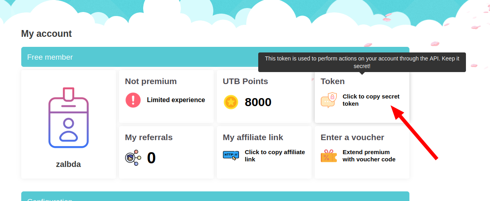

# uptobox-dl

## Overview

An Uptobox batch downloader. Uptobox allows, for free members, 30 min to wait before each download.

With `uptobox-dl`, you're able to download multiple uptobox/uptostream links without any other action other than grabbing the links and running `uptobox-dl`.

*Note: Uptobox is a file hosting provider*.

The only dependency is .NET runtime >= 3.1, thus it can be run from Linux, Windows, macOS.

## Usage

### Pre-requisites

* Download `uptobox-dl.exe`: go to [latest release](https://github.com/Aerion/uptobox-dl/releases/latest), download the .tar.gz and extract it
* Preferred: Get a user token (see [Get a user token from Uptobox](#get-a-user-token-from-uptobox))
* You may run `./uptobox-dl --help` afterwards from a shell (cmd.exe/powershell in Windows)

### Examples

With multiple links
```
$ ./uptobox-dl -t <my_user_token> https://uptobox.com/<filecode_1> https://uptostream.com/iframe/<filecode_2>
Start processing https://uptobox.com/<filecode_1>
Got waiting token, awaiting for 00:08:46 - until 3:17:23 PM
Got waiting token, awaiting for 00:00:31 - until 3:17:54 PM
396752005B/396752005B: 100%
Downloaded <my_file_1.ext>

Start processing https://uptostream.com/iframe/<filecode_2>
Got waiting token, awaiting for 00:25:42 - until 3:47:55 PM
```

Specifying an output directory
```
$ ./uptobox-dl --output-directory /tmp -t <my_user_token> https://uptobox.com/<filecode>
Start processing https://uptobox.com/<filecode>
5B/5B: 100%
Downloaded /tmp/myfile
```

### CLI

`./uptobox-dl -t <my_user_token> [my_links...]`

```
./uptobox-dl --help
uptobox-dl 1.2.0
Copyright (C) 2022 uptobox-dl

  -v, --verbose         Set output to verbose messages.

  -d, --debug           Print debug data.

  --output-directory    Output directory (defaults to the current working directory if unset)

  -t, --token           Uptobox user token. See
                        https://docs.uptobox.com/?javascript#how-to-find-my-api-
                        token

  --help                Display this help screen.

  --version             Display version information.

  value pos. 0          Uptobox links to download
```

### Run from release artifacts

Install the latest dotnet runtime: https://dotnet.microsoft.com/download/dotnet
If you don't want to install the dotnet runtime, build from source as described in the next section and use `--self-contained true`. The resulting artifacts can be copied to the target machine and run without any dependency.

Go to [latest release](https://github.com/Aerion/uptobox-dl/releases/latest), download the .tar.gz and extract it. You may run `./uptobox-dl --help` afterwards.

### Build from source

Install dotnet-sdk: https://dotnet.microsoft.com/download/dotnet

``` bash
git clone git@github.com:Aerion/uptobox-dl.git
# See https://docs.microsoft.com/en-us/dotnet/core/tools/dotnet-publish for the list of options
# linux-x64 for "mainstream" linux, use win-x64 for Windows. See https://docs.microsoft.com/en-us/dotnet/core/rid-catalog#using-rids for the full list
# use self-contained true if your target machine won't have .NET runtime installed, see https://docs.microsoft.com/en-us/dotnet/core/deploying/#publish-self-contained
dotnet publish uptobox-dl/uptobox-dl.csproj -c Release -r linux-x64 # --self-contained true
cd uptobox-dl/bin/Release/*/linux-x64
./uptobox-dl --help
```


### Why do I need a user token?

It allows you to speed up the time waiting for downloads (30min between each download instead of >1h), see [comparison between plans](https://uptobox.com/becomepremium).
It's **free**, you just need to create an Uptobox account.

#### Get a user token from Uptobox

It takes 2 minutes to grab it:

* Register a new account: https://uptobox.com/register
* Login: https://uptobox.com/login?referer=register
* Go to my account: https://uptobox.com/my_account
* Copy the user token

